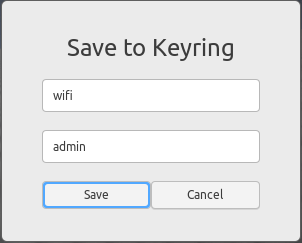

# Locker
Locker is a gnome-shell-extension that generates strong random passwords. This extension can generate alphanumeric and special character passwords. Additionally, this extension can save the generated password to your local keyring. Your local keyring encypts these passwords for safe storage.

## Installation

For manual installation 

```bash
cd ~/.local/share/gnome-shell/extensions

git clone https://github.com/namontalbano/gnome-shell-extension-locker.git

gnome-shell-extension-tool -e locker@namontalbano.email.neit.edu
```

## Features

### Generate a random password


Default values include:

- Ten character password length
- Special and alphanumeric charcters
- Passwords are not visble

NOTE: default values can be updated within the panel menu

For example,
to increase or decrease password length, provide the length in the input box. The radnomly generated password will now be the desired length, upon clicking Generate.

### Password Type


### Keychain Dialog



### Keychain Storage


## Licensing
[MIT](LICENSE)
